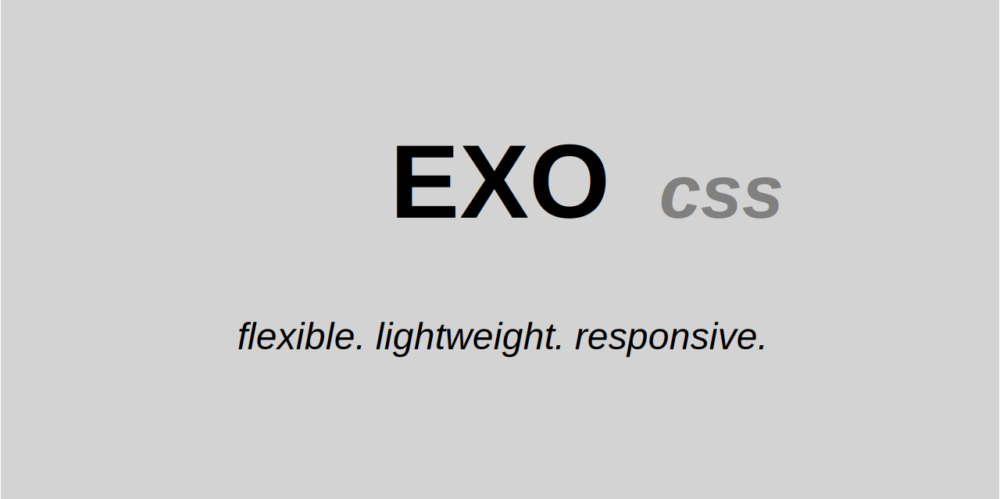

# EXOcss (beta)

flexible. lightweight. responsive.

EXOcss is a skeleton for creating responsive websites or web apps ultra fast.

EXOcss is very flexible and it provides a lot of different grid layouts (column system):

+ 1 column system
+ 2 column system
+ 3 column system
+ 5 column system
+ 5 percent steps column system

## why use EXOcss?
+ 💪🏼 ultra lightweight ( !!! exo.css is LESS THAN 5kb not minified + unzipped !!! )
+ ⚡ ultra fast
+ 🎮 just plug-n-play (no preprocessor needed!)
+ 🎨 extendible with css variables
+ 🛠 modular (just import what you need)
+ ✔️ good semantics
+ 📐 responsive

## browsers support (beta)
<table>
    <thead>
        <th>grid layout</th>
        <th>Chrome</th>
        <th>Firefox</th>
        <th>IE / Edge</th>
        <th>Safari</th>
        <th>Safari iOS</th>
        <th>Samsung </th>
        <th>Opera</th>
    </thead>
    <tbody>
        <tr>
            <td>flex</td>
            <td>coming soon</td>
            <td>coming soon</td>
            <td>coming soon</td>
            <td>coming soon</td>
            <td>coming soon</td>
            <td>coming soon</td>
            <td>coming soon</td>
        </tr>
        <tr>
            <td>float</td>
            <td>yes</td>
            <td>yes</td>
            <td>yes</td>
            <td>yes</td>
            <td>yes</td>
            <td>yes</td>
            <td>yes</td>
        </tr>
    </tbody>
</table>

## get started (setup)
html:
+ normalize.min.css is recommended.
+ exo.css is obligatory.
+ modules are optional.
+ custom styles are optional.
~~~html
    <!-- NORMALIZE -->
    <link href="css/otherCSS/normalize.min.css" rel="stylesheet">
    <!-- EXOcss CORE -->
    <link href="css/EXOcss/exo.css" rel="stylesheet">
    <!-- EXOcss MODULES -->
    <link href="css/EXOcss/modules/base/exoBase.css" rel="stylesheet">
    <link href="css/EXOcss/modules/heading/exoHeading.css" rel="stylesheet">
    <link href="css/EXOcss/modules/typography/exoTypography.css" rel="stylesheet">
    <!-- CUSTOM STYLES -->
    <link href="css/EXOcss/custom.css" rel="stylesheet">
~~~

## documentation
the style guide is the best way to show examples of EXOcss: [styleguide](index.html). just open in browser and see basics of EXOcss.

## features
+ [ + ] core (exo.css)

    + [  ] grid layout (floating)
        + [ + ] row
            + [ + ] basic
            + [ + ] responsive
        + [  ] container
            + [  ] basic
            + [  ] responsive
            + [  ] full height
        + [ + ] column
            + [  ] 1 column system
                + [  ] basic
                + [  ] offset left side
                + [  ] offset right side
                + [  ] offset both sides
                + [ + ] responsive
            + [  ] 2 column system
                + [  ] basic
                + [  ] offset left side
                + [  ] offset right side
                + [  ] offset both sides
                + [ + ] responsive
            + [  ] 3 column system
                + [  ] basic
                + [  ] offset left side
                + [  ] offset right side
                + [  ] offset both sides
                + [ + ] responsive
            + [  ] 5 column system
                + [  ] basic
                + [  ] offset left side
                + [  ] offset right side
                + [  ] offset both sides
                + [ + ] responsive
            + [ + ] 5 percent steps column system
                + [ + ] basic
                + [ + ] offset left side
                + [ + ] offset right side
                + [ + ] offset both sides
                + [ + ] responsive
        + [  ] hide element
            + [ + ] hide generally
            + [ + ] hide on mobile device
            + [ + ] hide on other device

    + [  ] grid layout (flexbox is in progress. coming soon!)
        + [  ] row
            + [  ] basic
            + [  ] responsive
            + [  ] full height
        + [  ] column
            + [  ] basic
            + [  ] offset left side
            + [  ] offset clear left side
            + [  ] offset right side
            + [  ] offset clear right side
            + [  ] offset both sides
            + [  ] offset clear both sides
            + [  ] responsive
        + [  ] element
            + [  ] hide generally
            + [  ] hide on mobile device
            + [  ] hide on other device

+ [  ] modules (this module list is constantly being updated and expanded, more to come.)
    + [  ] about us
    + [  ] application
    + [  ] badge
    + [  ] banner
    + [  ] blog (article / post)
    + [  ] breadcrumb
    + [  ] call to action
    + [  ] card
    + [  ] career
    + [  ] code
    + [  ] container / grid
    + [  ] content
    + [  ] contact
    + [  ] contacts
    + [  ] cookies
    + [  ] dashboard
    + [  ] download
    + [  ] features
    + [  ] faq
    + [  ] files (gallery / list)
    + [  ] footer
    + [  ] form
    + [  ] gantt diagram
    + [  ] header
    + [  ] how it works
    + [  ] http code
    + [  ] kanban
    + [  ] landing page
    + [  ] label
    + [  ] logo cloud
    + [  ] member (details)
    + [  ] members (gallery / list)
    + [  ] navigation
        + [  ] horizontal
        + [  ] menu
        + [  ] navbar
        + [  ] vertical
    + [  ] newsletter
    + [  ] notification
        + [  ] primary
        + [  ] secondary
        + [  ] info
        + [  ] success
        + [  ] danger
        + [  ] warning
        + [  ] alert
        + [  ] error
    + [  ] page template
    + [  ] portfolio
    + [  ] pricing
    + [  ] product (details)
    + [  ] products (gallery / list)
    + [  ] product category (details)
    + [  ] product categories (gallery / list)
    + [  ] project
    + [  ] projects
    + [  ] registration
    + [  ] reviews
    + [  ] search
    + [  ] search result
    + [  ] service
    + [  ] services
    + [  ] shop system
    + [  ] sign in
    + [  ] sign out
    + [  ] sign up
    + [  ] statistics
        + [  ] chart
        + [  ] diagram
        + [  ] graph
        + [  ] graph tile
        + [  ] statistic tiles
    + [  ] steps
    + [  ] table
    + [  ] team
    + [  ] testimonial
    + [  ] tiles
    + [  ] time line
    + [  ] toast
    + [  ] tooltip
    + [  ] user
    + [  ] users

## faq

    
can i customize EXOcss?

    
yes, easily. you have different options

    <ul>
        <li>put your custom styles into css/EXOcss/custom.css</li>
        <li>create your own cool modules</li>
        <li>use predefined modules from EXOcss. EXOcss modules are constantly being updated and expanded, more to come.</li>
    </ul>

    
can i extend EXOcss with css variables?

    
yes. you can use any custom variables you like.

    
notice: EXOcss variables start with exo, i. e. "exoColorPrimary".

    
what about modules for EXOcss?

    
no problem. EXOcss is flexible and based on modules. every EXOcss module has its own specific folder.

    
be creative. you can create your own cool modules or use the modules of EXOcss. EXOcss modules are constantly being updated and expanded, more to come.

    
support us. create awesome EXOcss modules and help us to grow in creativity and extend EXOcss.

    
how can i support EXOcss?

    
you are welcome. you can provide support in different ways:

    <ul>
        <li>creating awesome new modules for EXOcss and help us to grow in creativity and extend EXOcss.</li>
        <li>become a sponsor and donate, if you use EXOcss or if you think, that EXOcss is useful or if EXOcss has given you a coffee cup's worth of benefits.</li>
    </ul>

    
how to support EXOcss with modules?

    
you are welcome. you can support us with creating awesome new modules for EXOcss.

    
how to become a sponsor of EXOcss?

    
you are welcome. just follow the link to <a href="https://donate.stripe.com/3cs5lCaYMfFRa0EaEE" target="_blank">give something back</a>

    
why supporting or sponsoring EXOcss?

    
EXOcss is FREE FOR EVERYONE ! ! !

    
for personal and for commercial use.

    
MW provides a lot of software and utilities as freeware for the web without requiring the users to pay any fee.

    
however, maintaining the web site, updating the existing utilities and releasing new utilities require to invest a fair amount of time and also money (especially for hosting).

    
do you use EXOcss or do you find EXOcss useful? has EXOcss given you a coffee cup's worth of benefits this year?

    
make your decision and <a href="https://donate.stripe.com/3cs5lCaYMfFRa0EaEE" target="_blank">give something back</a>. with your donation you support the development of EXOcss and other useful free software.

    
i greatly appreciate your support!

    
kind regards

    
MW

## find + follow + support
+ web: https://exocss.org
+ mail: mail@exocss.org
+ github: https://github.com/mw-it/exocss
+ donation: https://donate.stripe.com/3cs5lCaYMfFRa0EaEE

## credits
thanks to Nicolas Gallagher for [normalize.css](https://github.com/necolas/normalize.css), see also [here](https://necolas.github.io/normalize.css).

## copyright + license
Copyright &copy; by Walid Moussa (MW) 
Code released under the [MIT license](https://github.com/mw-it/exocss/blob/main/LICENSE.txt).
